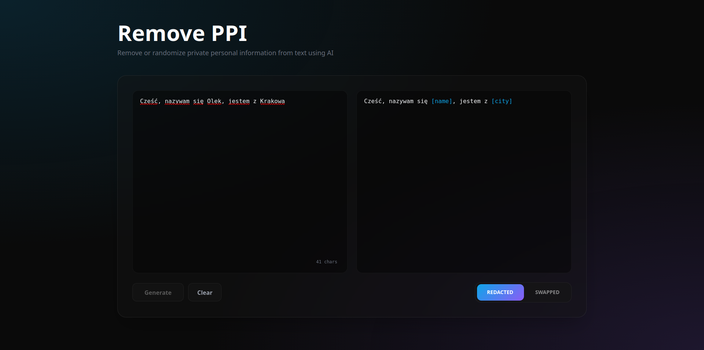

# PPI Remover

### NER na bazie herBERT + hybryda spaCy i Morfeusz2



## Setup projektu
```bash
pip install -r requirements.txt
```

## Uruchomienie WebUI
```bash
python -m django startapp ppiRemover
```
lub poprzez IDE

## Struktura projektu
 - **core** - inicjalizacja modelu, metody 
odpowiedzialne za tworzenie masek i wypełnianie ich losowymi danymi
 - **ppiRemover** - WebUI w Django
 - **train.ipynb** - Jupyter notebook użyty do fine-tuningu modelu
 - **eval.py** - Skrypt do ewaluacji danych finałowych